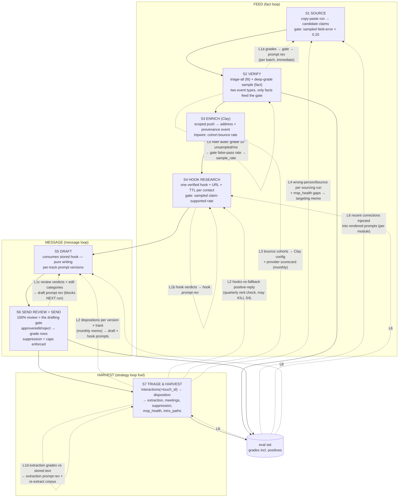

# Cohesium-OS: Fresh-Eyes Redesign of the Outreach & Learning Pipeline

*Outside review, 2026-07-21. Every factual claim about the current system was
verified by reading the code; citations are repo paths. Method: 9-subsystem
verified read → 3 competing architecture proposals + hypothesis challenge →
adversarial red-team of the proposed design → this synthesis.*

---

## 1. Executive summary

You built a learning system and then severed nearly every nerve that would let
it learn. Three findings dominate everything else:

1. **Prompt attribution points at text that was never used.** All four modules
   ignore the stored `prompt_versions` template at render time (the parameter
   is literally named `_template`); the real prompts live in code, and the
   drafting prompt has drifted across 4 commits since its DB snapshot was
   seeded, with zero version bumps. The active seeded drafting v1 mandates
   "acknowledge it is a cold email" — the exact thing the live code prompt
   forbids ([sourcing.ts:21-23](../web/lib/modules/sourcing.ts),
   [010_eval_layer.sql:210-248](../supabase/migrations/010_eval_layer.sql)).
   Every per-prompt-version outcome number you will ever compute is currently
   attribution to fiction.
2. **Reply content — the firm's actual product — is never captured.** Reply
   detection is sender-address matching; the text of what MSP customers say
   lands only in your personal inboxes. An angry opt-out and an enthusiastic
   yes produce identical data (`responded=true`). The `interactions`/
   `extractions` tables and `conversation_extraction_v1.md` — the original
   system's soul, and the right design — are written by nothing in the web app.
3. **Of four gates, three are dead.** Clay write-backs never set
   `sampled`/`review_status`, so enriched rows can't enter the grade queue;
   drafting writes touches, not contacts, so its gate can't leave `open`;
   personalization has no UI entry point. Only sourcing's gate is alive, and
   it is enforced only at the Draft page filter.

The redesign is therefore mostly **rewiring, not building**: the schema you
need (grades taxonomy, provenance columns, interactions/extractions, escalation
machinery, the `runner` executor) is largely already there, dead. The proposed
pipeline is seven stages — Source → Verify → Enrich → **Hook Research** (new,
resurrecting your dead personalization module) → Draft → Send Review & Send →
**Triage & Harvest** (new, resurrecting interactions/extractions, meetings, and
suppression) — with three learning loops instead of five symmetric ones:

- **Fact loop** (source/enrich/hooks): sampled human grades against evidence;
  the existing gate discipline, repaired and extended.
- **Message loop** (draft/send): your constitutional 100% human review *is*
  drafting's gate — it was just never recorded. Approve/edit/reject become
  grade rows; outcomes are dispositions from stored replies, not raw
  reply-rate.
- **Strategy loop** (monthly, deliberately human): dispositions, meetings,
  bounce cohorts, and minutes-per-positive-reply recalibrate targeting and
  prompts, with the decision stored as a written memo — because at 20
  sends/day your outer loop is directional, not statistical, and pretending
  otherwise is the drift mode.

Key reversals of your stated beliefs, argued in §8 and §5: uniform per-stage
gates are rejected (your own system already ran that experiment; three gates
died because two founders cannot feed four grading queues and two stages have
no human-checkable boundary truth). Personalization extraction is **kept** —
it is your strongest hypothesis, and half the plumbing already exists — but as
a copy-paste module first, not an agent tool, with staleness TTLs and a
built-in kill criterion. The pipeline-map view and recommendation engine are
rejected as new surfaces: the recommendation engine already exists and failed
for a routing reason (every login lands on `/review`, so nobody sees it).

Migration is 14–22 working days across eight independently shippable
increments, ordered so the honesty fixes (metric lies, suppression, reply
capture) land in the first days and nothing downstream calibrates against
fiction.

---

## 2. System boundary map

### Inputs crossing into the system

| # | Input | Captured today | Where it leaks (lost learning) |
|---|-------|----------------|-------------------------------|
| I1 | **Founder judgment-minutes** — vetting, grading, editing, approving, triaging. The binding resource of a 2-person firm | grades rows (corrected path only), touch_edits diffs, `reviewed` boolean | `seconds_spent` exists in schema+API but the UI never sends it ([grade-queue.tsx:119-125](../web/app/(app)/review/grade/grade-queue.tsx)); reject writes **no** grade row; approve writes no grade row; Review-A vetting collapses to one bit; deletes are hard DELETEs with no reason; send-approval is a default-TRUE boolean, so reviewed and never-reviewed are indistinguishable ([007_touch_drafts.sql](../supabase/migrations/007_touch_drafts.sql)) |
| I2 | **External LLM runs** (Claude/ChatGPT/Claude Code on founder subscriptions) | `runs.raw_io {rawText}` — lifecycle path only, parse-success only | Model identity never captured (`provider_label` is always `'copy-paste'`); raw output lost on parse failure ([lifecycle.ts:95-98](../web/lib/runs/lifecycle.ts)) and on the whole Draft-page path; `cost_usd` has no writer anywhere |
| I3 | **Prompt-engineering effort** | `prompt_versions` (immutable rows, notes, author) | Rendered prompts come from code, not the DB rows — version stamps point at text never used; activation/rollback events unlogged; no link from a failed gate to the revision it motivated |
| I4 | **Clay credits + waterfall config** | Nothing | No provider, cost, confidence, or timestamp lands on write-back ('clay' appears in zero SQL); push outcomes toasted and dropped; `pending` conflates never-pushed with awaiting-Clay; push ignores the selection UI and ships every pending contact ([review-actions.ts:107-142](../web/lib/sourcing/review-actions.ts)) |
| I5 | **Send capacity / domain reputation** | `EMAIL_DAILY_CAP`, `touches.provider` | No bounce detection at all on the SMTP path; no unsubscribe or spam-complaint concept; HeyReach volume unbounded by any cap ([cron/email/route.ts:63-67](../web/app/api/cron/email/route.ts)); reputation is spent blind |
| I6 | **Seed lists / CSV imports** | contacts rows | CSV rows enter with `confidence='high'` and zero evidence — the least-verified path gets the most-trusted label ([import-form.tsx:51](../web/app/(app)/source/import/import-form.tsx)) |
| I7 | **Gate policy tuning** | `settings` (current values only) | Overwritten in place, no history or actor — which threshold governed a past gate decision is unreconstructable ([settings/actions.ts:12-30](../web/lib/settings/actions.ts)) |
| I8 | **Inbound replies** | Sender address → `responded`, `status='replied'`, `replied_at` | Content never stored (IMAP reads envelope only, [imap.ts:83-85](../web/lib/send/imap.ts); webhook reply text discarded); reply→touch attribution broken — ALL outbound touches flip with no prior-status filter, including never-sent ones |
| I9 | **Ad-hoc manual research effort** — founders googling a prospect, reading an MSP's site for a hook, market-mapping outside a run | Nothing (at best implicit in pasted LLM context) | No cost side exists for any yield-per-hour comparison; in the proposed design this is the input the Hook Research stage consumes, so its rent check (§9) needs researched-minutes logged on hook runs to be honest |

### Outputs leaving the system

| # | Output | Captured today | Where it leaks |
|---|--------|----------------|----------------|
| O1 | Sent messages | touches (body, status, sent_at, provider, prompt_version_id) | LinkedIn 'sent' stamped at HeyReach lead-**add**, not send ([send.ts:104-110](../web/lib/send/send.ts)); failed SMTP sends stay `'queued'` forever (`'failed'` status unreachable) |
| O2 | Replies | Count + timestamp | Content, sentiment, intent all lost; O2 is the raw material of O3–O5 and it evaporates |
| O3 | **Meetings / conversations held** | **Nothing** | The conversion the system exists for has no table; `stage` values `in_conversation`/`nurturing`/`closed` are write-only or never set |
| O4 | **MSP intelligence** (satisfaction, switching intent, pain points, tech stack) | **Nothing** (web app) | `extractions` + the extraction prompt exist in the abandoned Python core; zero writers. Goal 1's product has no landing zone |
| O5 | Relationships / warm-intro network | **Nothing** | `intro_paths`: zero code references |
| O6 | Hygiene signals (bounces, unsubscribes, spam flags) | `bounced_at` via the Smartlead webhook only (the HeyReach handler covers reply/accept/sent — no bounce event) | Smartlead never sends (dead path) so its bounce webhook never fires; SMTP and LinkedIn bounces invisible; unsubscribes have **no representation** — an honesty-critical gap for a firm that promises "not selling anything" |
| O7 | Eval artifacts (grades, corrections, edit diffs, rejects) | grades, touch_edits, rejected_ingest | Failures only — no positive examples; `error_category` always null; eval-set JSONL endpoint has no consumer; `rejected_ingest` is write-only (no UI reads it) |
| O8 | Market map (orgs, MSP↔customer links, coverage) | organizations, msp_stats | Merge/confirmation events untracked; customer-count is the only health proxy |

**The pattern:** capture is highest where learning value is lowest (counts,
statuses) and lowest where it is highest (reply content, rejection reasons,
meetings, provider performance, founder time). Every table you need to fix
O3–O6 already exists in the schema, unwritten.

---

## 3. Proposed pipeline — all loops drawn



Loop summary (details in §5): four **inner loops** (L1a–d) run per batch at
grading/review speed; three **calibration loops** (L2–L4) run monthly off
stored dispositions/bounces/meetings and terminate in written memos + linked
prompt/config revisions (L2's hooks-vs-fallback component is reviewed
quarterly — it needs a quarter of sends to be directional); the **rider
audit** (L5) measures the gate itself;
**few-shot injection** (L6) is the cheapest fully-mechanical loop. The strategy
loop's cadence is monthly *by design honesty*: at a 20/day cap you get 5–15
classified replies a month — enough to steer, not enough to auto-tune.

---

## 4. Stage contracts

| Stage | Input | Unique output artifact | Policy (versioned thing) | Inner metric + gate | Ground truth | Failure / gaming mode | Human role |
|-------|-------|------------------------|--------------------------|---------------------|--------------|----------------------|------------|
| **S1 Source** | Run config + sourcing prompt run in external LLM; pasted JSON | Candidate org/contact claims: batch + run, `contacts.run_id` (new), evidence **appended**, ingest report persisted on the run | Sourcing prompt (git-owned; rendered text + template hash auto-snapshotted per run — see §5) | Sampled field-error rate < 0.20; small-batch repair: entire sample graded, floor min(batch, 5); decision snapshotted to `gate_decisions` | Grader verifies fields against evidence URLs (existing a/c/r queue) | Model emits famous, easily-verified orgs — accuracy up, yield down. Guard: error rate and `new_for_target` yield displayed together, never merged into one score | Configure run, execute prompt, paste; grade sample. Approve now writes `correct` grades; reject requires category + reason |
| **S2 Verify** | Sourced batch | Vetted contact set: fit-triage **events** (accept / reject+reason, org-level) + deep-grade sample verdicts. Deletes become soft-rejects with reason | Triage rubric (fit criteria checklist, versioned in code; recalibrated by L4 — fit-accepted contacts that later hit wrong_person/opt-out, and fit-rejected orgs that later surface as customers of healthy MSPs, both feed the monthly memo, which may revise the rubric with `motivated_by` like any prompt) | Gate math consumes **only** deep-grade fact verdicts. Triage rejects are tracked separately as fit-rate | Fact grades: evidence URLs. Fit verdicts: none (they are preference, not correctness — never in gate math) | **Contamination**: fit-rejects counted as gate errors → false gate failures → operator stops rejecting to keep gates green. Guard: two event types by construction; alarm if triage-reject rate trends to zero | Quick org-level fit pass on all; deep grade on the sample. Same workspace, two intensities |
| **S3 Enrich** | Verified, gate-passed, **selected** contacts | Address-bearing contact + `enrichment_events` row {provider, fields_set, prior values, Clay verification status (valid/catch-all/risky), pushed_at, received_at} | Clay table config, hand-versioned tag stamped on events | **Tripwire, not pre-advance human gate**: cohort bounce rate ≥5% blocks the *next* push; Clay's own verification status recorded per row. The human sample here checks **identity only** (right person, right company — checkable via LinkedIn/site), never address validity; write-backs set `sampled`/`review_status` so those identity checks enter the existing grade queue | Address truth is delivery: DSN/bounce artifacts captured by S7, weeks later. Identity truth: the person's own public profile. A human eyeballing an address verifies nothing — which is why address quality is telemetry-shaped, not grade-shaped | Catch-all domains never bounce and never land: fill-rate and bounce-rate both look fine while the list rots. Guard: store Clay's catch-all flag; flag cohorts with 0% bounce AND 0% reply over 50+ sends | Select who gets spend; spot-check sampled identities; own the Clay table |
| **S4 Hook Research** (new) | Enriched contacts headed to drafting; hook prompt via the existing personalization module (copy-paste first) | `hooks` table row: {contact_id, text, source_url, source_published_at, researched_at, kind, status: candidate/verified/rejected/expired/used}. `kind='none'` + fallback_angle is a **first-class, non-error outcome** | Hook prompt (module='personalization', renamed); recency/kind preferences live in the prompt | Sampled verification: (1) URL supports the *specific* claim, (2) claim is specific to this person/company — both required. Threshold 0.25. TTL: expired hooks re-enter as refresh runs | The source URL, clicked by the grader. Mechanical floor: URL-liveness check at ingest | Generic-but-verifiable hooks ("they have a website") game check 1 — check 2 exists for exactly this, and `generic` joins the error taxonomy. Null-hook scored as failure would incentivize invention — the exact honesty violation the firm bans; hence null-hook is valid | Start hook runs; grade sampled hooks (~30s each); see hook + source inline at send review |
| **S5 Draft** | Contacts with live verified-or-fallback hooks; per-track prompt | Planned touches with run_id, prompt_version, `hook_id`, `track` (new) — via the run lifecycle (raw_io captured **including parse failures**); importDrafts bypass deleted | Drafting prompt, one active version per track (msp / customer) | Untouched-approve rate ≥ 0.75 per drafting run — **measured at S6**, where the constitutional 100% review happens; breach blocks the *next* drafting run. Drafting itself becomes pure writing: fast and re-runnable because research cost was paid in S4 (this also de-confounds prompt A/B: hooks held constant across draft versions) | 100% founder review verdicts (proximate, recorded at S6); S7 dispositions (ultimate) | Blandness drift: prompt overfits to founder editing taste — approve-rate rises while positive replies fall; guard = L2 pairs the two per version. Re-draft loops that overwrite rejected copy destroy the negative example — rejected bodies snapshotted before overwrite | Pick track, run prompt, paste. Judgment happens at S6, where it is recorded |
| **S6 Send Review + Send** | Planned touches; suppression set; caps | Approval events (approved default **FALSE**, approved_by/at) + review verdicts as grades: approve-untouched=`correct`, edit=`corrected`+category chip, reject=`rejected`+category; then honest transmission states (SMTP failure → `failed`; LinkedIn `sent` only on HeyReach SENT webhook; Message-ID stamped into `provider_ref`) | Send config (caps incl. HeyReach, cadence) — changes append to `settings_history` | **The drafting gate, free of charge**: untouched-approve rate ≥ 0.75 per drafting run. Failure blocks the *next* drafting run (banner), never the human-fixed messages. Suppression invariant: zero sends to suppressed contacts (audited on every cron run, before the send window) | Founder judgment at the constitutionally-mandatory 100% review; ultimate truth = S7 dispositions | **Fatigue inversion**: approve-rate rises when the prompt improves AND when the reviewer rushes. Guard: seconds-per-review captured on the approval event; approve-rate is never a promotion criterion alone (§6) | Read every message (unchanged); verdicts now cost ~2 clicks and stop evaporating |
| **S7 Triage & Harvest** (new) | IMAP bodies + headers, HeyReach reply payloads, pasted threads/call notes/meeting notes | `interactions` rows (resurrected: + touch_id via In-Reply-To, + headers) → human **disposition** (positive / neutral / not_now / opt_out / ooo_auto / wrong_person / bounce); opt_out → `suppressions`; substantive threads → `extractions` via a fifth copy-paste module (prompt = conversation_extraction_v1); `meetings` rows (held requires notes interaction); `msp_health` view (≥3 distinct voices before a score renders); intro_paths finally written | Triage taxonomy + extraction prompt (module='extraction'), versioned; re-extraction over the stored corpus on version bump | Capture coverage ≥95% of replied email touches have a substantive interaction (gaming mode: stub pastes satisfy "non-empty" — guard is a minimum-length floor + the weekly inbox diff); triage latency <24h; extraction accuracy graded at sample_rate 1.0 — volumes are small: 5–15 email replies/month at the 20/day cap, plus a few pasted calls/meetings/threads per week | The stored verbatim reply text — permanent, re-auditable ground truth one click from every verdict | **Junk intelligence**: extracting from a 12-word "call me Thursday" fragment yields null-ish rows that *look* like MSP intelligence, and the strategy loop then steers on fabricated yield. Guard: extraction only on human-marked complete threads; intelligence yield counts only human-confirmed extractions. Triage optimism bias: monthly cross-audit — the other founder re-triages 10 random replies | Triage each reply (one keystroke); paste what automation can't reach (calls, LinkedIn threads); log meetings; grade extractions — this is where the founders' inbox becomes the database |

A note on stage boundaries: **Vet and Grade merge** (same act, two intensities,
one workspace — but two *event types*, because fit-preference must never enter
fact-gate math). **Personalization splits out of Draft** (your H2, kept — see
§8). **Send Review stays fused to Send** (its artifact is the approved-send-set;
splitting them would make two stages share one output). **Triage & Harvest is
one stage, not three** — classification, extraction, and meeting-logging all
append to the same conversation corpus; separate stages would be ceremony at
1–3 interactions/day.

---

## 5. Learning architecture

### 5.1 Prompt truth — the precondition, done the cheap way

Prompts stay in git (the builders do real conditional logic; you keep diffs and
PR review). What changes: at run creation the app stores the **fully rendered
prompt text** and a **hash of its template portion** on the run row, and
auto-registers a `prompt_versions` row whenever a new (module, template-hash)
appears. Versioning becomes mechanical — no human sync step to forget, which is
the failure mode that produced today's theater. Labels/notes can be attached to
auto-registered versions after the fact. (DB-templating with `{{token}}`
interpolation was considered and rejected: it moves prompt logic out of code
review and costs weeks; hash-snapshotting costs an afternoon and makes
attribution honest immediately.)

### 5.2 The loops

| Loop | Signal | Recalibrates | Cadence | Stored where |
|------|--------|--------------|---------|--------------|
| L1a Source gate | Sampled field grades | Sourcing prompt; blocks Clay spend + drafting | Per batch, at grading speed | `grades` (now incl. `correct` + reject reasons), `gate_decisions` snapshot {counts, rate, threshold, sample_rate, at} |
| L1b Hook gate | Sampled hook verdicts (claim-supported + specific) | Hook prompt; blocks that batch's drafting | Per hook batch | `grades` (unit=hook), `hooks.status` |
| L1c Draft gate | 100% send-review verdicts + edit category chips | Drafting prompt (blocks next drafting run on breach) | Per drafting run | grades on touches, `touch_edits` + category |
| L1d Extraction gate | Extraction grades vs stored reply text | Extraction prompt; re-extract corpus on revision | Per interaction (100% at current volume) | `grades` (module=extraction), superseded `extractions` kept for version-to-version comparison |
| L2 Disposition calibration | Positive/opt-out dispositions per prompt_version × track × channel | Draft + hook prompt choices; audience allocation | **Monthly ritual** (~45 min); its hooks-vs-fallback rent check runs **quarterly** (needs a quarter of sends to be directional) | `decision_log` memo citing the query snapshots; `prompt_versions.motivated_by` + retired_at (new columns, M4) |
| L3 Deliverability | Bounce/DSN + Clay verification status per enrichment cohort | Clay waterfall config; provider trust | Monthly (tripwire fires immediately) | `enrichment_events`, config-version tag, memo |
| L4 Targeting | Wrong-person/bounce/disposition rates per sourcing run; `msp_health` coverage gaps | Which segments/MSPs/personas get sourced next | Monthly | `decision_log`; next runs' configs cite the memo |
| L5 Rider audit | Grade 10 `skipped_sampling` contacts from passed batches | The gate itself: measured false-pass rate → sample_rate changes | Monthly (failure mode: n=10 is noisy — act only on two consecutive audits agreeing) | grades (grader='rider-audit'), `settings_history` |
| L6 Few-shot injection | Last N wrong/missing corrections per module (the eval-set endpoint finally gets a consumer) | The rendered prompt itself, mechanically | Every run (built in M4) | Injected example IDs recorded in run config |

### 5.3 Lineage model (the join spine)

```
touch → run → prompt_version(hash) → template in git
touch → hook → hook run + source_url
touch → contact → sourcing run + batch + enrichment_events(provider)
touch → track (msp|customer)
interaction → touch (In-Reply-To / provider_ref Message-ID)  ← the missing edge today
extraction → interaction (verbatim text = permanent ground truth)
meeting → contact → interaction (notes)
grade → {contact|hook|touch|interaction} + field + run
gate_decision → batch + settings snapshot
decision_log ← memos citing all of the above
```

New columns/tables vs today: `contacts.run_id`, `touches.track` + `hook_id` +
approval columns, `interactions.touch_id` + headers + disposition, `hooks`,
`meetings`, `suppressions`, `enrichment_events`, `gate_decisions`,
`settings_history`, `decision_log`, `pipeline_snapshots`,
`prompt_versions.motivated_by` + `retired_at`. Everything else is already in
the schema.

### 5.4 What "the system got smarter" means, concretely

Improvement exists only if it is stored in one of five places:

1. **A new prompt version** whose `motivated_by` links the gate decision or
   memo that triggered it, and whose outcome delta is computable on Outcomes
   (per version × track, on *dispositions*, not raw replies).
2. **A growing eval set with positive examples** — approve writes `correct`
   grades; reject writes categorized failures; consumed mechanically by L6 and
   by regression replay when a runner executor arrives.
3. **Scorecards that move spend**: provider bounce cohorts → Clay config;
   segment yield → targeting memos.
4. **Threshold/sample-rate changes with rationale** in `settings_history`
   (today they're amnesiac overwrites).
5. **The corpus itself**: verbatim interactions, re-extractable under better
   prompts forever — the legacy Python design's best idea, kept.

Learning that lives in a founder's head fails the definition. That is why L2
and L4 terminate in a *written memo* — the memo is the artifact; a vibe check
is the failure mode.

---

## 6. Automation roadmap

Standing rule: **generation may be automated; approval may not.** "A human
approves every message before it sends" is constitutional, so full closed-loop
send automation is permanently out of scope. Automation is earned per-module by
eval history and revoked by the same history.

### NOW — mechanical, no judgment transferred (week 1)

| Change | Why it isn't a judgment handoff |
|--------|--------------------------------|
| Login lands on `/` (the journey engine) — one line | Routing fix; the recommender already exists |
| Cron 2×/weekday (the route already polls replies before sending; the Vercel schedule is already weekday-only — add a weekday guard only for the external `?token=` scheduler path) | Same human decisions, fresher stop-flags |
| Suppression enforcement at queue AND cron send time; conservative string-match auto-suppress on "unsubscribe/remove me", pending human confirm | Protective default; human confirms |
| Reply body + header capture → interactions; DSN/bounce capture on SMTP | Pure capture |
| Metric-lie fixes: prior-status filter on reply flips, distinct-count rebuild of draft_outcomes, SMTP `failed` status, HeyReach under the shared cap | Correctness |
| Prompt hash-snapshot + auto-version registration | Pure capture |
| Scoped Clay push (selection + gate-passed only) + push/event persistence | Removes an unscoped side-effect |
| Hook URL-liveness check at ingest | Mechanical floor under a human gate |
| Set `ENRICHMENT_WEBHOOK_SECRET` in prod | The write-back endpoint is currently unauthenticated service-role when unset |

### NEXT — automation with human spot-check

| Handoff | Promotion criterion (must be met first) | Demotion trigger |
|---------|------------------------------------------|------------------|
| Auto-push to Clay on verify-approve | Scoping + `enrichment_events` shipped AND 2 consecutive manual pushes reconcile 1:1 with Clay rows (the Clay table is production — see risk R4) | Any push/write-back mismatch, or cohort bounce ≥5% |
| Hook research → `runner` executor (first candidate: cheapest, most objective gate) | ≥100 graded hooks total AND 3 consecutive hook batches passing at ≤0.25 with min-sample binding | Rolling error > threshold on last 50 (wire `shouldEscalate` as a *suggestion*: sample_rate → 1.0 + revert to copy-paste) |
| LLM pre-triage of replies (suggests disposition; human confirms each) | ≥100 human triages stored AND ≥90% model-human agreement measured on 4 consecutive weekly samples | Agreement <85% on any weekly sample; opt-out recall < 100% is an instant kill |
| Extraction pre-fill (model drafts, human corrects in the grade queue) | ≥30 human-graded extractions AND field error <10% across 2 prompt versions | Field error >10% on any monthly sample |
| Sourcing → `runner` executor | 5 consecutive passed runs AND ≥100 graded records over ≥3 weeks AND rider-audit false-pass <5% on 2 consecutive audits | One failed gate, or rider audit ≥10% |

### LATER — closed inner loops (human stays on approval + samples)

| Handoff | Promotion criterion | Demotion trigger |
|---------|---------------------|------------------|
| Runner drafting (model generates via API against stored prompt + hooks; **100% human send-review stays** — it is the gate) | Untouched-approve ≥75% for 5 consecutive runs *with* median review time stable (rate and seconds must not move oppositely — the R1 fatigue guard) | Untouched-approve <75% on any run, OR approve-rate and review-seconds diverging, OR any hook honesty failure found at review → back to copy-paste |
| Auto-advance of passed batches into hook-research / drafting queues (skip the manual "start next stage" click) | 3 months of gate history with zero manual overrides of gate verdicts | First manual override of a gate verdict, or any auto-advanced batch later failing its downstream gate |
| Sample-rate auto-ratchet (`shouldEscalate` fully wired, both directions) | Ratchet-down allowed only after rider audits stay <5% false-pass for a full quarter | Any single rider audit ≥5% → sample_rate back to 1.0 immediately (ratchet up is always automatic, down is always earned) |
| LLM triage without per-item confirmation — **except opt-outs, which always get human eyes** | 6 months of ≥95% weekly agreement | Any weekly agreement sample <95%, or any missed opt-out ever → back to confirm-each |

NEXT-tier demotion triggers carry forward unless a stricter LATER trigger
supersedes them. At current volumes the evidence for these promotions
accumulates over quarters, not weeks — the ladder is patient by design. Every
promotion and demotion is itself an event in `settings_history` with the eval
evidence cited — the automation ladder is part of the learning record.

---

## 7. Gap analysis & migration plan

### Steelman of what exists (what NOT to lose)

The eval gate's critics would say n=20 with no confidence intervals isn't
statistics. Correct, and beside the point: at this scale the gate is a
**forcing function with a stored verdict**, not an estimator. It guarantees a
human looks at a reproducible (FNV-1a, un-cherry-pickable) sample of every
batch before money or reputation is spent; fail-fast caps wasted grading; the
threshold is a pre-committed bar against in-the-moment rationalization. The
keyboard grade queue, the 8-category error taxonomy, the module contract
(renderPrompt/parse/ingest with the `runner` executor reserved), touch
provenance + touch_edits-as-implicit-grades, the sourcing ingest machinery
(zod fail-soft, dedup, cross-batch merge, MSP guard, rejected_ingest), the
honest-outreach prompt content, the journey engine, and the boring one-cron
stack are all **kept**. The failures documented in §1–§2 are wiring defects,
not design defects.

### Delete list

Dead-or-drifting halves of dual systems, each kept side named: `importDrafts`
bypass (run lifecycle wins) · copy-paste enrichment module (registry code with
no UI entry; Clay wins — and this module's ingest would clobber prior
`review_status` if ever wired up) · Smartlead add-leads path AND webhook
(nothing ever sends via it) · `prompt-builder.tsx` (unused duplicate) ·
`contacts.reviewed` boolean (review_status wins) · `contacts.stage`
(6 writer sites, 0 readers; state is queries + suppressions + interactions) ·
`contacts.personalization` (hooks table wins) · `contacts.source` constant ·
settings `auto_escalate`/`escalated_at`/`run_after_gate` columns (escalation
returns as a wired suggestion, not dead columns) · runs statuses
`queued`/`running` until a runner exists · touches `letter`/`call` ·
`sourcing_runs` (yield folds into the persisted ingest report; `msp_stats`
re-pointed) — scheduled last, it's a view rewrite · Python core demoted to
`archive/` with README rewritten around the web app (its extraction *contract*
is resurrected in S7) · stale gate-blocks-enrich/send comments and HANDOFF
phases that shipped. Batches stay short-term with run:batch enforced 1:1 —
killing the table is a migration that doesn't pay rent yet.

### Migration — eight independently shippable increments (14–22 working days, ~3–4.5 focused weeks)

| # | Increment | Effort | Unblocks |
|---|-----------|--------|----------|
| M1 | **Truth & safety**: metric-lie fixes; suppressions table + enforcement + opt-out matcher; HeyReach cap; IMAP window 7d; cron 2×/weekday poll-first; login → `/`; prod webhook secret | 1–2 d | Every later number stops lying; honesty gap closed. Ship first — nothing downstream calibrates against fiction |
| M2 | **Reply capture**: interactions.touch_id/headers/disposition; Message-ID → provider_ref at send; IMAP body fetch; HeyReach reply text; Log-interaction form; triage queue in journey; DSN → bounce disposition | 2–3 d | Outer-loop ground truth; every uncaptured reply is permanently lost corpus |
| M3 | **Judgment durability**: approve/reject write grades (positives at last); error_category + seconds_spent chips; approved default FALSE + by/at; soft deletes with reason; `gate_decisions`; `settings_history`; persist ingest/push reports | 1–2 d | Eval set becomes usable; fatigue + drift become measurable |
| M4 | **Prompt honesty**: rendered-prompt + template-hash snapshot; auto-version registration; `prompt_versions.motivated_by` + `retired_at`; L6 few-shot injection at render (eval-set consumer, injected IDs in run config); Draft page onto run lifecycle (raw_io incl. failures); `touches.track`; `contacts.run_id` | 2–3 d | Trustworthy per-version × track attribution; the cheapest real learning loop ships |
| M5 | **Enrichment accountability**: scoped push (spend is gated by scoping + the bounce tripwire); `enrichment_events` incl. Clay verification status; write-backs set sampled/review_status so identity spot-checks enter the grade queue; cohort bounce join; reviewed_at | 2–3 d | Spend stops being unbounded; provider scorecard exists |
| M6 | **Hook stage**: hooks table; hook-run builder reusing the personalization module + fan-out prompt; TTL + liveness check; grade-queue unit; drafting consumes hooks; hook+source inline at send review; `hook_id` on touches (the kill-criterion instrument) | 3–4 d | De-confounded draft A/B; personalization becomes verifiable |
| M7 | **Harvest**: extraction module (from conversation_extraction_v1) over interactions; meetings table + logger (held requires notes); `msp_health` view (≥3-voices floor) + MSP dossier; `decision_log`; intro_paths writes | 3–4 d | Goal 1's product finally lands in the database |
| M8 | **Ritual surfaces**: Outcomes v2 (dispositions × version × track × channel; hooks-vs-fallback; minutes-per-positive-reply — a directional strategy-loop input only, never a per-person target: optimizing it directly rewards rushed review, the R1 pressure); calibration memo writer; rider-audit flow; `pipeline_snapshots` on the cron; sourcing_runs fold-in | 1–2 d | The monthly ritual, with its learning stored |

### The operating loop this buys (workflow UX)

**Daily (~30–45 min), in work-queue order on the home page** (the journey
engine, finally seen, extended with conversation-first priorities): ① triage
new replies — keystroke dispositions, confirm any auto-suppressions; ② log
yesterday's conversations/meetings, run extraction on completed threads;
③ grade queues — source sample, hook sample, enrichment identity sample;
④ send-queue review with hook + source inline; ⑤ feed the machine — start
runs, push scoped Clay batches. A health strip shows: cron heartbeat, failed sends,
bounce trend, capture coverage, untriaged-reply age, Clay stragglers, cap
usage, and any gate banners. No new views: the home page + existing
workspaces + Outcomes v2, all reading **one shared pipeline-state module** so
the Draft page, journey engine, and cards can't drift apart (today journey.ts
hand-mirrors the Draft filter and admits it in a comment).

**Weekly (~15 min)**: snapshot deltas — queue depths, bounce trend, capture
coverage. **Monthly (~60 min)**: the calibration ritual → one `decision_log`
memo. **Quarterly**: hook rent check, rider-audit review, automation ladder.

---

## 8. The rejected architecture: uniform module federation

**The design** (your H1, steelmanned): five self-contained stage modules, each
with the identical embedded loop — versioned policy → sampled human eval →
gate → revise — nested in an outer loop where end outcomes re-tune each local
metric. Symmetry, clean mental model, matches the Gradebook heritage; every
stage gets the discipline that made sourcing trustworthy.

**Why it lost:**

1. **Your own system already ran the experiment, and the result is in.** The
   eval layer was built symmetrically — settings rows, gate thresholds, and
   grade-queue field sets exist for all four modules — and three of the four
   gates died on contact with reality (§1.3). That is not an implementation
   accident; it is the 2-person constraint expressing itself. Two founders
   cannot feed four grading queues, so the loops without an objective,
   immediately-checkable error definition went unused.
2. **Two stages have no human-checkable truth at their boundary.** An enriched
   email's correctness is proven by *delivery*, weeks later; a send's
   correctness is mechanical (SMTP/IMAP). Human sampled grades there verify
   nothing — the dead copy-paste enrichment module is the fossil of exactly
   this mistake (and its ingest destroys prior grades as a bonus). Enrich and
   Send need telemetry tripwires, not grade queues.
3. **Drafting already has a 100% human gate by constitution.** A sampled
   pre-gate in front of a mandatory full review is pure throughput tax; the
   correct move — recording the review that already happens — costs ~2 clicks
   per message and produces a *census*, not a sample.
4. **Uniform gates invite eval theater**, which is worse than no eval: a
   green tile over a dead loop launders trust. The proposed design gives gates
   only to stages whose artifacts a human can actually judge (claims, hooks,
   messages, extractions) and telemetry to the rest.

What survives from it: the loop *shape* (versioned policy → sampled eval →
gate → revise) for the four artifact stages, and H2's hook extraction — which
was the best idea in the belief set and is kept nearly intact.

### Second alternative considered: the artifact-ledger

A genuinely different shape was developed in parallel: one append-only
`events` table (actor, verb, subject, run, payload) capturing *every* judgment
and outcome — grades, pushes, sends, dispositions, deletes, settings changes —
with stages demoted to queries over artifact state (journey.ts generalized),
and batches/gates demoted to run-scoped queries with decision snapshots. Its
steelman is real: every finding in §1–§2 is the same defect — "a judgment
occurred and nothing durable was appended" — and an append-only ledger fixes
that class of bug once, structurally, instead of table-by-table. It also fits
this system's amnesiac-overwrite pathology (settings, gate status, enrichment
values) better than in-place state ever will.

**Why it lost as a whole:** (1) its classic failure mode is silent write-path
omission — a new feature forgets `appendEvent()` and the ledger quietly stops
being complete, with no error anywhere; discipline is the only enforcement,
and this codebase's verified history (four dead gates, dead columns, stale
seeds) is a history of exactly that discipline not holding. (2) The
generalized form (per-artifact confidence, stages-as-projections) is
abstraction two people won't maintain, and it discards the batch/gate objects
that the working grade queue and Runs page are built around. What is absorbed
from it, table-by-table where a typed schema keeps the write path honest:
`gate_decisions`, `settings_history`, soft-deletes-with-reason, persisted
push/ingest reports, and the daily queue-depth snapshot.

---

## 9. Top 5 risks in this design, and how to catch each early

| # | Risk | Early detection |
|---|------|-----------------|
| R1 | **Fatigue-inverted draft gate.** Untouched-approve rate rises both when the prompt improves and when the reviewer rushes; the promotion ladder converts the second into runner automation | Chart approve-rate against median seconds-per-review from day one (both captured in M3). Opposite movement = fatigue artifact; promotion is barred whenever they diverge. Weekly blind re-review of 5 already-approved drafts |
| R2 | **Junk intelligence.** Extractions run on reply fragments produce null-ish rows that count as "intelligence yield"; the strategy loop steers on fabricated signal while real conversations stay in personal inboxes | Distribution of interaction length under extractions: if >30% of extractions carrying a satisfaction/switching_intent value derive from interactions <50 words, extraction is eating fragments. Month-one spot-check: 5 extractions vs the actual inbox thread |
| R3 | **Triage/gate contamination or its overcorrection.** If fit-rejects leak into gate math → false failures → the operator learns to stop rejecting (gate trains the human out of judgment) | The two rates are stored separately by construction; alarm on correlation between triage-reject rate and deep-grade error rate, and on triage-reject rate trending to zero over 6 weeks |
| R4 | **Automation fires before its prerequisites** — the archetype: auto-push onto today's unscoped Clay push against the production Clay table → duplicate spend, prod pollution, no provenance | Ordering is encoded in §6's promotion criteria; verify with daily reconciliation of Clay rows created vs contacts approved (ratio >1.05 = unscoped) starting with the first automated push |
| R5 | **Ritual decay.** The monthly memo is the strategy loop's storage; rituals rot, and no table can force one | The journey engine nags on `decision_log` age ("last calibration memo: 47 days"); a quarter with zero memos while prompts/settings changed anyway (detectable — changes lack `motivated_by` links) is the tripwire to simplify the ritual rather than abandon it |

Honorable mention: the hook stage may simply fail to pay rent (staleness,
generic hooks, no reply lift). That risk is deliberately instrumented rather
than avoided — `touches.hook_id` makes hooks-vs-fallback computable from day
one, and the quarterly rent check folds the stage back into drafting if
verified hooks don't beat honest fallbacks on positive-reply rate. A stage
that carries its own kill criterion is a bet, not a commitment.

---

*Full verified findings (9 subsystem maps with file:line citations for every
claim in §2) are available on request; the load-bearing twenty are summarized
in §1–§2 and cited inline.*
